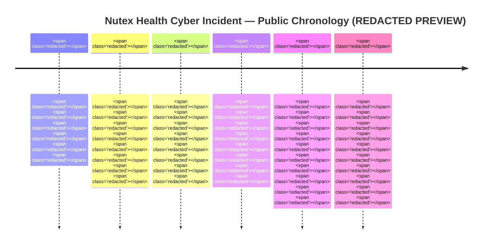

# Executive Intelligence Brief — SHOPPABLE PREVIEW (REDACTED)
## Nutex Health Inc. (NASDAQ: NUTX) — Material Cybersecurity Incident & Published-Data Escalation

> **PREVIEW ONLY.** Substantive analytical findings, timelines, litigation identifiers, executive directory details, regulatory clock calculations, and buyer playbooks are redacted. Purchase the full $1,500 standalone brief for unredacted delivery (same-day / 24-hour; no retainer). Recurring monitoring, if requested, floors at $35,000/month paid quarterly upfront.

**Product:** $1,500 Standalone Executive Intelligence Brief (one-time purchase; no retainer)  
**Prepared:** 2026-09-11 07:53 UTC  
**Classification:** Commercial intelligence for Law Firms / Crisis PR / MSSPs  
**Document control:** FOIA-style preview · Source: full brief held under commercial license  
**Scoring context:** Tier-1 pick (score  / 100) — Legal  · Ability-to-pay  · Speed  · Multi-buyer 

**Evidence legend:** `[confirmed]` · `[claimed]` · `[inferred]` — full source appendix      

**Attribution gaps:**            

---

# Page 1: Executive Summary & Critical Incident Overview

## Company profile `[confirmed]`
Nutex Health Inc. is a physician-led healthcare management and operations company headquartered at   , Houston, TX . It operates three divisions: ; ; and . Public company facts used in this brief:
- Ticker: **NUTX** (NASDAQ)
- Footprint: ** hospital facilities in  states** `[confirmed — ]`
- FY2025 revenue: **** `[confirmed — ]`
- CEO & Chairman:  `[confirmed]`
- CFO (8-K signatory):  `[confirmed]`

## Incident in one paragraph
An unauthorized third party accessed Nutex network-stored data and **exfiltrated** private/confidential information. Nutex first disclosed under **Item ** (), then escalated to **Item 1.05 Material Cybersecurity Incidents** () after confirming        . On ****, Nutex stated the unauthorized party ****; Nutex is       and says its prior materiality assessment is . Multiple putative class actions are pending in , including **, Case No. **** (filed ). `[confirmed —    ]`

## Immediate exposure matrix

| Dimension | Status | Label |
|---|---|---|
| Data exfiltration |     |  |
| Data categories |         |  |
| External publish threat |     |  |
| Actual publication |      |  |
| Ops / financial systems impact |     |  |
| Materiality to investors |      |  |
| Litigation |      |  |
| Affected headcount |     |  |
| Threat actor name |     |  |
|  |     |  |
|  |     |  |

## Regulatory clock (snapshot)
- **SEC Item 1.05:**         `[confirmed]`
- **HHS OCR / HIPAA Breach Notification:**               `[inferred · confirmed]`
- **State AG / multi-state notice:**           `[inferred]`
- **:**        
- **:**        

---

# Page 2: Threat Actor Profile & Attack Vector

## What is known `[confirmed]`
- Unauthorized activity involving data stored on Nutex’s computer network.
-          
-          
- Actor **** to post information externally ().
- Actor **** allegedly obtained data on “” ().

## What is not disclosed / withheld in preview
- Initial access method —          
- Named ransomware / extortion brand —        
- Ransom demand amount / negotiation status —      
- Encryption vs. pure exfiltration (double-extortion) —          
- Tooling / dwell time / lateral movement path —          
- Leak-site URL / sample file inventory —        

## Analytical working hypothesis `[inferred]` — FULL TEXT RESTRICTED
                   

               

           

## Leak staging
: Nutex is            . Volume        .

---

# Page 3: Compromised Data & Asset Footprint

## Categories named in Item 1.05 `[confirmed]`
1. **** information —        
2. **** information —      
3. **** information —      
4. **** information —      
5. **** —      

## Severity mapping `[inferred]` — ELEMENT-LEVEL DETAIL RESTRICTED

| Asset class | Business unit relevance | Severity | Evidence status |
|---|---|---|---|
|  |  |  |    |
|  |  |  |    |
|  |  |  |    |
|  |  |  |    |
|  |  |  |    |
|  |  |  |    |

## Affected footprint notes
-            
-            
- Record count / N:         `[attribution gap in public filings; full brief models exposure ranges]`
- PHI element coding worksheet:          

---

# Page 4: Minute-by-Minute Chronology

### Structured `<Timeline>` — KEY DATES & DOCKET TRIGGERS RESTRICTED

| When | Event | Label | Source |
|---|---|---|---|
|  |         |  |  |
|  |         |  |  |
|  |         |  |  |
|  |         |  |  |
|  |           |  |  |
|  |           |  |  |
|  |           |  |  |
|  |           |  |  |

---

# Page 5: SEC Regulatory & Materiality Analysis

## Disclosure path `[confirmed]` — DETERMINATION MINUTES RESTRICTED
1. ** — Item :**              
2. ** — Item 1.05:**              
3. ** — Non-8-K update:**            

## 4-day Item 1.05 clock status
                 

             

Counsel diligence asks (full brief):            

## Board oversight risks
- Org / CISO reporting gap analysis:          
- Audit / Risk committee documentation pack:          
- Insider trading / DCP controls during investigation:        

## Investor narrative tension `[inferred]`
               

           

---

# Page 6: Multi-Jurisdictional Compliance Deadlines

## Federal healthcare

| Regime | Trigger | Typical clock | Nutex posture |
|---|---|---|---|
| HIPAA / HHS OCR |     |  |      |
| OCR investigation / CMP |    |  |      |
| FTC / Section 5 |    |  |      |
|  |    |  |      |

## State AG / consumer notice matrix — STATE-BY-STATE TABLE RESTRICTED

| Framework | Why it matters here | Individual notice | AG notice |
|---|---|---|---|
|  |     |  |  |
|  |     |  |  |
| CCPA/CPRA |     |  |  |
| NY SHIELD |     |  |  |
|  |     |  |  |
|  |     |  |  |
|  |     |  |  |
|  |     |  |  |

**Full brief includes:** resident-count modeling worksheet, element-trigger map (SSN / DOB / Dx / financial), and portal filing checklist.        

---

# Page 7: Class-Action & Shareholder Litigation Risk

## Active / disclosed litigation `[confirmed]` — CAPTIONS & CASE NOS. RESTRICTED
- ******, Case No. ****, , filed ****.  
- Putative class definition:            
- Claims asserted:              
- Relief sought:            
- Additional purported complaints:        

## Plaintiffs’ bar mobilization `[inferred]`
               

           

## Shareholder / securities overlay `[inferred]`
             

## Defense themes likely `[inferred]` — FULL STRATEGY MEMO RESTRICTED
        ·         ·         ·         ·        

---

# Page 8: B2B Supply Chain & Third-Party Blast Radius

## Internal ecosystem
- **Hospital Division:**          
- **Population Health / IPA / MSO:**            
- **Real Estate Division:**      

## Contractual pressure points

| Instrument | Likely issue | Buyer angle |
|---|---|---|
| HIPAA BAAs |      |     |
| Payer / network contracts |      |     |
| MSA / SLA with hospital JVs |      |     |
| Cyber insurance |      |     |
|  |      |     |

## Customer blast-radius note
               

---

# Page 9: Containment & Technical Remediation Review

## Company-stated actions `[confirmed]`
-      
-      
-      
-      
-        

## Unknown / open IR questions — FULL TECHNICAL DILIGENCE LIST RESTRICTED
1.            
2.            
3.            
4.            
5.            
6.            
7.            
8.          

## Operational impact
             

---

# Page 10: Executive & Board Governance Checklist

### For dual CLOs / legal — NAMES & ACTION DETAIL RESTRICTED
- [ ]              
- [ ]              
- [ ]              
- [ ]              
- [ ]            

### For IT / security leadership
- [ ]              
- [ ]              
- [ ]              
- [ ]            

### For Board / Audit Committee
- [ ]              
- [ ]              
- [ ]              
- [ ]            

### For Finance / CFO
- [ ]              
- [ ]            

---

# Page 11: Service Provider Pitch Playbook ($1,500 SKU)

## Product rules (visible)
- **Primary SKU:** $1,500 one-time Executive Intelligence Brief — same-day / 24h turnaround, **no retainer**.  
- **Upsell gate:** Recurring monitoring floor **$35,000/month paid quarterly upfront**.

## Law firm value prop — FULL PLAYBOOK RESTRICTED
               

           

## Crisis PR / reputation value prop — FULL PLAYBOOK RESTRICTED
               

           

## MSSP / IR / forensics value prop — FULL PLAYBOOK RESTRICTED
               

           

## Objection handling

| Objection | Response |
|---|---|
| “We’ll wait for more facts” |         |
| “We only buy retainers” | This is explicitly one-and-done at $1,500; retainer starts at $35k/mo quarterly |
| “Is the actor known?” |         |
|  |         |

---

# Page 12: Target Executive Contact Directory (Internal Nutex)

Public leadership roles relevant to engagement / diligence. **Personal emails, direct dials, and prioritized outreach order redacted in preview.**

Corporate switchboard (public):  ·  ·    

| Role | Name | Notes | Label |
|---|---|---|---|
| CEO & Chairman |  |    | confirmed |
| President |  |    | confirmed |
| CFO |  |    | confirmed |
| COO |  |    | confirmed |
| CMO |  |    | confirmed |
| CLO (Healthcare) |  |     | confirmed |
| CLO (SEC) |  |     | confirmed |
| Director of Compliance |  |    | confirmed |
| IT Director / security owner |  |     | confirmed |
| Marketing / IR / PR |  |    | confirmed |
| Internal Audit |  |    | confirmed |
| Human Resources |  |    | confirmed |
|  |  |    | confirmed |
|  |  |    | confirmed |

**LinkedIn / enrichment paths:**            

---

## Source appendix — FULL CITATIONS RESTRICTED
1.            
2.            
3.            
4.            
5.            
6.          

---

## How to unlock

<a href="https://loganbesecker.com/Compliance/nutex-health-brief-preview">Purchase Brief Here</a>
